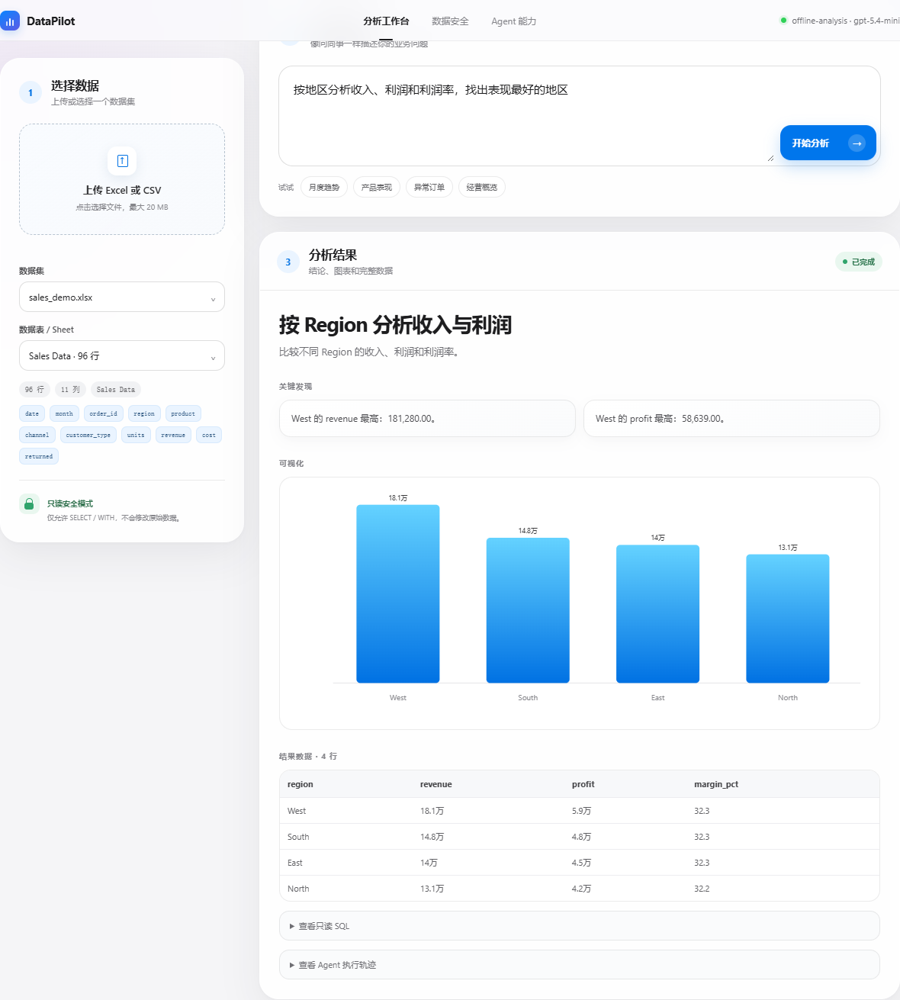
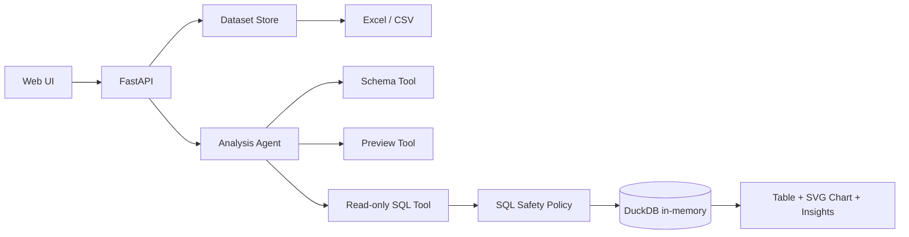

# DataPilot

[](https://github.com/just1n926/datapilot-agent/actions/workflows/ci.yml)
[](https://render.com/deploy?repo=https://github.com/just1n926/datapilot-agent)

DataPilot 是一个面向 Excel/CSV 的只读数据分析 Agent。用户上传表格并提出业务问题，Agent 自动理解字段、生成受限 SQL、执行统计分析，再返回可复核的结果表、图表与关键结论。

它解决的是高频实际问题：业务人员不需要手写 SQL 或 Pandas，也能快速完成销售拆解、趋势分析、产品对比和异常检测。


## 核心能力

- 上传 `.csv`、`.xlsx`、`.xlsm`，支持 Excel 多 Sheet
- 自动规范化表名和列名，展示类型、空值和样例
- OpenAI Agents SDK tool calling 与 `Pydantic` 结构化输出
- 无 API Key 时提供可用的离线分析引擎
- DuckDB 内存分析，连接层关闭 external access
- SQL 双重安全控制：仅允许单条 `SELECT/WITH`，阻止修改、外部文件读取和扩展加载
- 异步任务、实时状态轮询、结果表与原生 SVG 图表
- 可复现评测集和指标统计
- FastAPI、Docker、GitHub Actions 与完整自动化测试



## 架构



## 快速开始

```powershell
cd datapilot
python -m venv .venv
.\.venv\Scripts\Activate.ps1
python -m pip install -e ".[dev]"
datapilot serve
```

访问 `http://127.0.0.1:8000`。项目会自动加载 `sample_data/sales_demo.xlsx`，无需 API Key 即可尝试：

- 按地区分析收入、利润和利润率
- 分析月度收入和利润趋势
- 按产品比较经营表现
- 找出收入异常订单

也可以使用 Docker：

```powershell
docker compose up --build
```

## 公网演示部署

仓库包含 `render.yaml` 和 `Dockerfile`，可以在 Render 上直接创建 Blueprint。公开演示默认使用离线分析引擎并关闭文件上传，只展示内置样例，避免陌生人向服务上传数据。

点击上方 **Deploy to Render** 按钮可以直接进入 Blueprint 创建页面。

1. 将本项目推送到 GitHub。
2. 登录 Render，选择 **New → Blueprint**。
3. 连接 GitHub 仓库并应用根目录中的 `render.yaml`。
4. 部署完成后访问 Render 提供的 `*.onrender.com` 地址。

如需在自己的私有部署中开放上传，将 `DATAPILOT_ALLOW_UPLOADS` 设置为 `true`。如需启用真实 Agent，再在 Render 控制台添加 `OPENAI_API_KEY`，并把 `DATAPILOT_MODE` 设置为 `openai`。不要把 API Key 写进代码或提交到 GitHub。

完整步骤见 [部署说明](docs/DEPLOYMENT.md)。

## 接入真实模型

```powershell
$env:OPENAI_API_KEY="sk-..."
$env:DATAPILOT_MODE="openai"
$env:DATAPILOT_MODEL="gpt-5.4-mini"
datapilot serve
```

真实模型模式使用 OpenAI Agents SDK 的 function tools、run context、structured output 和 tracing；敏感 trace 内容默认关闭。

- [Agents SDK 概览](https://developers.openai.com/api/docs/guides/agents)
- [Agent definitions](https://developers.openai.com/api/docs/guides/agents/define-agents)

## API

| Method | Path | 作用 |
|---|---|---|
| `GET` | `/health` | 服务、模型和数据集状态 |
| `POST` | `/api/datasets` | 上传 Excel/CSV |
| `GET` | `/api/datasets` | 查询已加载数据集 |
| `GET` | `/api/datasets/{id}/preview` | 预览规范化数据 |
| `POST` | `/api/analyses` | 异步创建分析任务 |
| `GET` | `/api/analyses/{id}` | 查询结果与 Agent 轨迹 |

## 测试与评测

```powershell
python -m pytest
ruff check .
datapilot eval --cases evals/cases.jsonl
```

评测指标包括任务完成率、结果列准确率和图表类型准确率。当前内置 4 个确定性用例仅用于回归测试；简历发布前应扩充至至少 30 个覆盖真实业务问题的案例。

## 安全边界

1. 上传文件限制格式、大小、行数和列数。
2. 数据仅加载到当前服务进程内存。
3. DuckDB `enable_external_access=false`，禁止查询读取本机其他文件。
4. SQL policy 拒绝注释、多语句、DDL/DML、`COPY/ATTACH/INSTALL/LOAD` 和文件读取函数。
5. 模型生成的最终 SQL 必须重新经过服务层校验，不能绕过安全策略。
6. 公网作品集部署可通过 `DATAPILOT_ALLOW_UPLOADS=false` 禁止陌生文件上传。

这是作品集 MVP。生产化仍需要身份认证、持久化存储、租户隔离、后台任务队列、审计日志和容器级资源限制。

## 简历描述

> 设计并实现 Excel/CSV 数据分析 Agent，支持多 Sheet 解析、自然语言转只读 SQL、经营指标分析、异常检测和 SVG 可视化；通过 DuckDB external-access 隔离、SQL AST 前置规则与服务端二次校验控制数据访问风险，并建立可复现评测集衡量结果列和图表准确率。
